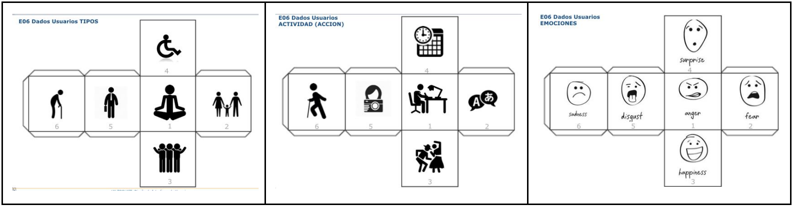

# laplaza

Aplicación destinada a la gestión de eventos culturales de la universidad con formato de red social

[Demo](https://davidbaug.github.io/laplaza/)

### Evaluación: Test A/B

#### Personas

|Nombre del Evaluador|Sexo|Edad|Ocupación|Experiencia en internet|Uso de la tecnología[PC Windows]|Uso de tecnología [PC (MAC/Linux)]|Uso de tecnología [Movil (Android)]|Uso de tecnología [Movil (IOS/Nokia/WIndows)]|Uso de tecnología [Tablet]|Conocimiento / uso de agendas de ocio|
| ---- | ---- | ---- | ---- | ---- | ---- | ---- | ---- | ---- | ---- | :--- |
|José Juan María|Hombre| 30 - 45 |Banquero|Avanzado|Siempre (a diario)|Poco/nada|Frecuente|Poco/nada|Poco/nada|1|
|María|	Mujer|	15 - 30 |	Estudiante|	Avanzado|	Poco/nada|	Siempre (a diario)	|Poco/nada|	Siempre (a diario)|	Siempre (a diario)|	4|
|Josefina|	Mujer|	>= 60|	Jubilada|	Bajo|	Poco/nada|	Poco/nada|	Poco/nada|	Poco/nada|	Poco/nada|	1|
|Team Rocket|	Hombre|	15 - 30 |	Ingenieros en una empresa joven|	Avanzado|	Frecuente|	Siempre (a diario)|	Siempre (a diario)|	Siempre (a diario)|	A veces|	4|

##### **Evaluación A**

- **Persona mayor - Baile - Enfadado**

  **Josefina**

  Josefina es una jubilada y dispone de bastante tiempo libre. Le gusta bailar y la cocina, pero no sabe cómo acceder a estos eventos de forma sencilla ya que no domina las nuevas tecnologías.

- **Grupo de amigos - Intercambio de idiomas - Disgustados**

  **Team Rocket**

  En un grupo de amigos proponen la idea de asistir a un intercambio de idiomas con el fin de mejorar su vocabulario y pronunciación de una forma divertida y que les permita conocer a gente nueva. Quieren que les sea fácil encontrar los eventos, ver la gente interesada y que la entrada sea gratuita.

##### **Evaluación B**

- **Padre de familia - Banquero - Feliz** 

  **José Juan María**

  Usa la web para encontrar eventos a los que asistir con su familia. La visita en casos puntuales cuando dispone de tiempo libre y quiere encontrar algún evento cercano al que le interese asistir.

- **Joven - Estudiante - Asustada**

  **María**

  Joven estudiante que en su tiempo libre asiste a distintos eventos para conocer a gente y exprimir al máximo su experiencia universitaria. Usa la web para descubrir cosas nuevas y para contactar con gente que comparta sus mismas aficiones.

#### Resultados

#### **Informe**

Al analizar la web podemos ver que presenta una estructura clara y sencilla, tampoco es muy amplia pues podemos encontrar todo el contenido dividido en 4 elementos, cada cual con una función específica. Una vez accedemos a la aplicación web entramos directamente a la página principal donde se nos muestra una serie de eventos y sus datos más importantes, desde esta sección podemos acceder a cada evento para ver la información detallada.

En la barra de navegación encontramos dos pestañas que nos permiten encontrar eventos específicos, la primera de ellas, denominada **Categorías** nos muestra un menú con las distintas categorías a las que los eventos pueden pertenecer, y al seleccionar una se muestra una lista con los eventos pertenecientes a esa categoría. Al mostrar los eventos de una categoría específica la disposición de los mismos cambia, de modo que no aparecen de la misma forma que en la página principal. En caso de seleccionar la segunda pestaña, denominada **Buscar Evento**, observamos que un menú de búsqueda ocupa un amplio porcentaje de la pantalla y mostrando un comportamiento estático. En la parte no ocupada por el menú de búsqueda se muestra otra la lista de eventos resultante de hacer la búsqueda. De nuevo, la disposición de esta lista no es similar a ninguna de las anteriores.

En la última pestaña de la barra de navegación podemos encontrar un enlace que nos muestra información sobre la aplicación. De mismo modo se dispone la información repartida por toda la pantalla intercalando texto e imágenes, y al final de todo podemos encontrar un formulario de contacto.

**Problemas:**

La disposición de los eventos es muy dispar. En cada página los encontramos de una forma distinta, cosa que puede hacer que el usuario se pierda.

No encontramos un menú que nos permita navegar a eventos futuros (flechas de navegación para cambiar entre páginas). Con la forma actual no sabemos si se dispondrán todos los elementos en una página o sólo podremos acceder a los 4 primeros en orden cronológico.

Falta de hiperenlaces en la cabecera que nos permita acceder a la página principal.

No landing page.

No encontramos una forma sencilla de acceder al formulario de contacto, tenemos que explorar entre todos los submenús hasta encontrarlo.

Al tener una cabecera estática se fuerza al usuario a volver a la parte superior de la página para cambiar de menú.

En el footer no aparece ninguna información relevante.

No aparece ningún evento destacado que pueda ser de interés para el usuario.

La página no dispone de un buscador fácilmente accesible para búsquedas rápidas (qué podría haberse incluído en la cabecera).